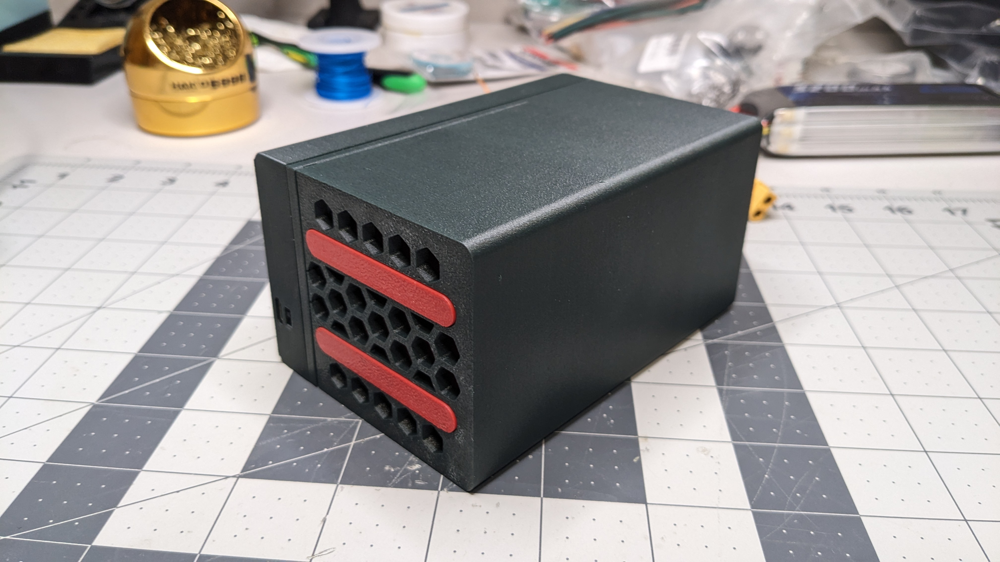
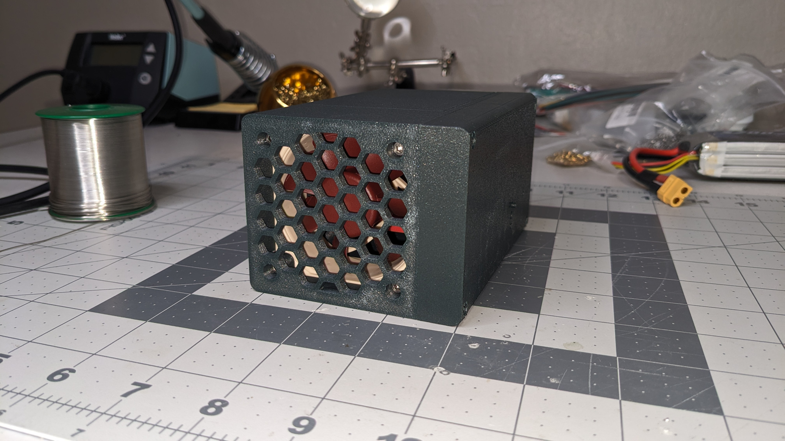

# ssd-chiller

A 3d printed cooler for Samsung T7 Touch SSDs. They have a tendency to run dangerously hot during extended use, this project is intends to keep them cool. The enclosure might also fit Samsung T7 Portable (Gen 2) SSDs as they're supposedly slightly smaller.

## enclosure

The FreeCAD project and STL files for the enclosure

## micropython

MicroPython source code for the Pi Pico

### License

MPL 2.0

#### Exceptions

- `rgb_hsv_conversion.py`: https://github.com/TheAlgorithms/Python/blob/master/conversions/rgb_hsv_conversion.py
- Noctua NF-A6x25 model: https://grabcad.com/library/nf-a6x25-noctua-fan-60mm-1

## Pictures

#### Front

#### Back

#### Fan

