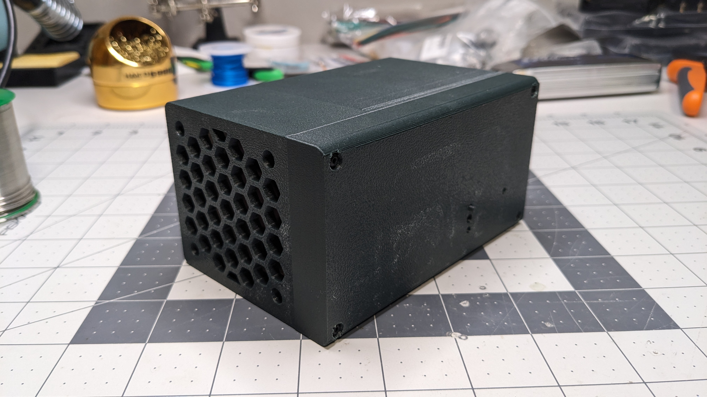

# pico-fancontroller

A simple fan controller program for the Pi Pico.

Enclosure is for Samsung T7 Touch SSDs (85 mm x 57 mm x 8 mm). The Samsung T7 Portable might fit as it's supposedly slightly smaller.

### Pictures

### License

MPL 2.0

#### Exceptions

- `rgb_hsv_conversion.py` MIT License (Copyright (c) 2016-2022 TheAlgorithms and contributors): https://github.com/TheAlgorithms/Python/blob/master/conversions/rgb_hsv_conversion.py
- Noctua NF-A6x25 model: https://grabcad.com/library/nf-a6x25-noctua-fan-60mm-1
